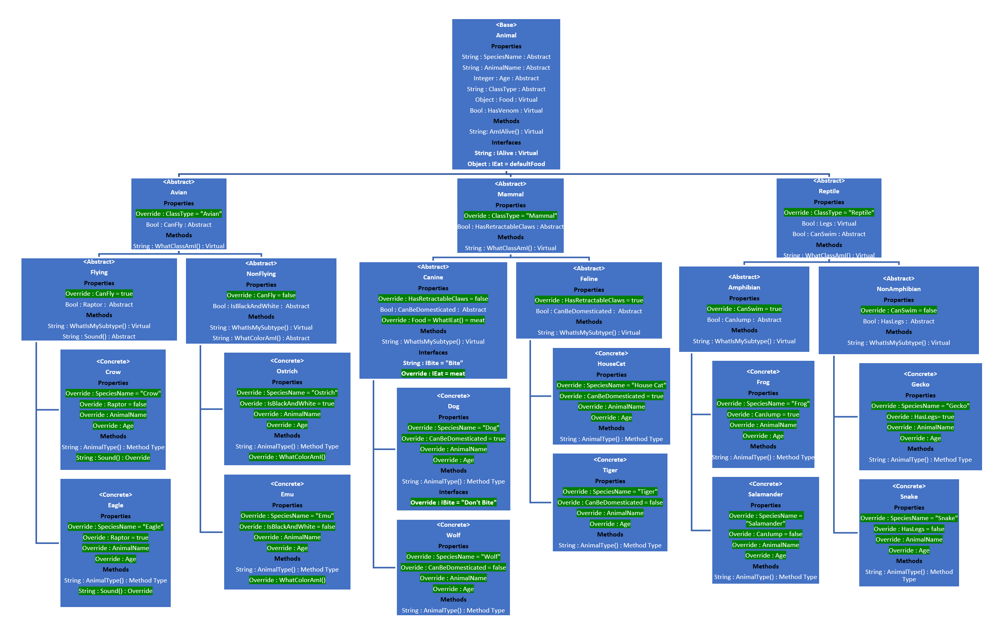

# Lab 05 and 06: I Built A Zoo
 - Using all 4 of the Object Oriented Principles (OOPs): - Build out the hierarchical class structure of a zoo within Visual Studio and a digital diagram. - There should be at least 3 layers of inheritance with at least 6 different types of animals.
   - Prove that the OOP principles are being used by returning strings as necessary to prove that a methods were property implemented or inherited.
     - Examples include: Eat() Sleep() Sound() etc…
     - You are allowed to use these example methods, along with others not listed
   - Include the following labels:
     - Label the parent and derived classes
     - Label the abstract classes and concrete classes
     - Label the access modifiers for each of the classes
     - Label where you are using Polymorphism in your program. Where are the virtual and abstract methods defined, and where are they being overridden?
 - Your program class should instantiate each of the concrete animals to prove the functionality of it’s base classes.

 - This is part 2 of a 2 part assignment.
    - Create a minimum of 2 interfaces.
    - Each interface created should be implemented by more than one class.
    - Have at least one class implement more than one interface
    
 - Test your code with Unit testing
 -Label interfaces as <interface>

 - When running your application, it should output each of the concrete animals and one behavior that it has inherited without any direct code manipulation
 
## Specs

- Have at least 3 different abstract classes
- Have at least 3 layers of inheritance
- Have at least 5 concrete animals
- Have at least 2 abstract methods (make sure you override them)
- Have at least 2 abstract Properties (make sure you override them)
- Have at least 2 virtual methods (make sure you override at least one of them)
- Have at least 2 virtual properties (make sure you override at least one of them)

- Your (digital) drawing of your zoo diagram should be clearly labeled 
NOTE: You are not required to be scientifically correct with your animal names. You will not be fact checked. You do not need to label your animals anything more complicated than (Mammal, Reptile, Cat, Bird, etc….)

## Unit Tests
- Test that each of your concrete animals exhibit the at least 2 appropriate behaviors given to them from a base class.
- Test the site for the following functionality:

    - Prove that the classes that implement the interface actually implement it
    - Prove inheritance
    - Prove Polymorphism
      - Prove methods have been overridden
      - Prove that one of your concrete animals is an Animal

## Example Usage
- To Create and animal select from list of avaliable animals. 
  - Crow
  - Dog
  - Eagle
  - Emu
  - Frog
  - Gecko
  - HouseCat
  - Ostrich
  - Salamander
  - Snake
  - Tiger
  - Wolf
- Animal ObjectName = new Animal()
  - ex. Crow imACrow = new Crow()
- Properties that can be given to a animal.
  - Name = string
  - Age = integer
- Methods Avaliable to Animal.
  - AmIAlive() = string
    - ex) imACrow.AmIAlive() returns "I am an animal."
  - WhatClassAmI() = string
    - ex) imACrow.WhatClassAmI() returns "I am an avian."
  - WhatIsMySubType() = string
    - ex) imACrow.WhatIsMySubType() returns "I can fly."
  - AnimalType() = string
    - ex) imACrow.AnimalType() returns "I am a crow."
- Interfaces Avaliable to Animal
    - Avaliable to all Animals
    - IAlive = string
      - ex) imACrow.Speak() returns "Alive"
    - IEat = Food class object
        - Food name = new Food();
          - Name = string
          - Type = string
        - ex) 
        
                imACrow.Food === Food defaultFood { Name = "Default Food", Type = "Default Type}
                Food newFood = Food(); 
                {
                Name = "New Food"
                Type = "New Type"
                } 
                imACrow.Food = newFood;
                imACrow.Food === Food newFood { Name = "New Food", Type = "New Type}

- Interfaces Avaliable to Canine Class (Dog and Wolf)
    - IBite = string
      - ex) imADog.Bite() = "Don't Bite"
      - ex) imAWolf.Bite() = "Bite"     

    ## Zoo Diagram

### Link to Zoo Diagram
    
 -   https://1drv.ms/w/s!AuC1SlsAQi6yj9J43ElGyX-ux23Sfw
